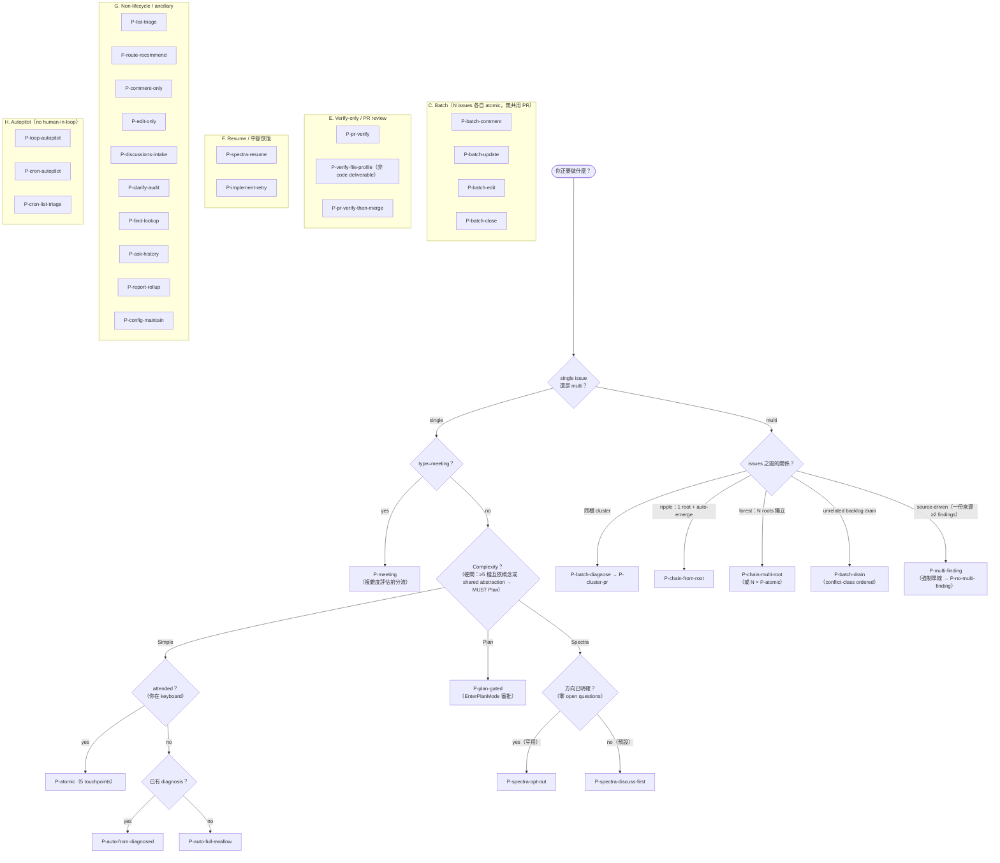

# IDD Path Map

> **36 條 sanctioned path 的選擇導航圖** — maintainer 日常查詢用（#276）。
> Single source：[docs/workflows.md](https://github.com/PsychQuant/issue-driven-development/blob/main/docs/workflows.md)（§ Path Flowchart + § Path Catalog）；
> 本頁由 `scripts/generate-path-map.py` 生成，**請勿直接編輯** — 改 workflows.md 後重跑 generator。

## Path 一覽（依類別）

### A. Single-issue lifecycle paths(typical bug / feature flow)

| Path | 說明 |
|------|------|
| `P-atomic` | Simple complexity baseline |
| `P-plan-gated` | Plan tier with EnterPlanMode approval |
| `P-spectra-discuss-first` | Spectra tier with alignment |
| `P-spectra-opt-out` | Spectra with direction pre-confirmed(罕用 |
| `P-meeting` | meeting-type deliberation（#57，v2.93+ |

### B. Convenience-orchestrator paths(快速 lifecycle 完成)

| Path | 說明 |
|------|------|
| `P-auto-from-diagnosed` | diagnose 已過,跑自動化 |
| `P-auto-full-swallow` | legacy `idd-all` 一次跑完 |
| `P-batch-drain` | multi-issue conflict-class-ordered sequential（v2.83+，#182 |
| `P-cluster-pr` | N issues 共 1 PR |
| `P-chain-from-root` | 1 root + auto-emergent spawn |
| `P-chain-multi-root` | 多 root forest chain |

### C. Batch paths(N issues 各自 atomic)

| Path | 說明 |
|------|------|
| `P-batch-diagnose` | - **Use case**:同 doc 來源 N issues,各自 diagnose 各 user-reviewable |
| `P-batch-comment` | - **Use case**:批次加同一段 note(e.g.「blocked by upstream」)到多 issue |
| `P-batch-update` | - **Use case**:批次同步 Current Status phase |
| `P-batch-edit` | - **Use case**:批次套同一段 edit 到多 issue 既存 comment |
| `P-batch-close` | - **Use case**:cluster PR merge 後批次 close,**每個 issue 仍各自獨立 closing summary** |

### D. Multi-finding dispatch paths(source-driven mixed routing)

| Path | 說明 |
|------|------|
| `P-multi-finding` | auto-triggered |
| `P-no-multi-finding` | force single-issue |

### E. Verify-only / PR-review paths(external agent integration)

| Path | 說明 |
|------|------|
| `P-pr-verify` | - **Use case**:外部 agent(Codex / Copilot)開的 PR,IDD 6-AI ensemble verify |
| `P-verify-file-profile` | 非 code deliverable 驗證（#258，v2.97+ |
| `P-pr-verify-then-merge` | - **Use case**:verify-gated PASS 後 user 主動 merge,**per IDD MANIFESTO**「auto-merge 須走 #3… |

### F. Resume / continuation paths(mid-work recovery)

| Path | 說明 |
|------|------|
| `P-spectra-resume` | - **Use case**:Spectra change 中途 requirements 變更,重新對齊 spec 後繼續 |
| `P-implement-retry` | - **Use case**:Chain mode 某 issue verify FAIL,retry on cluster branch(避免另開新 branch) |

### G. Non-lifecycle / ancillary paths(maintenance + observation)

| Path | 說明 |
|------|------|
| `P-list-triage` | - **Use case**:開工前 triage,看哪些 open issue,各自 phase 為何 |
| `P-route-recommend` | - **Use case**:選 agent(Codex / Claude / etc.) |
| `P-comment-only` | 非 lifecycle 推進 |
| `P-edit-only` | - **Use case**:編輯既存 comment(append / replace / prepend-note) |
| `P-discussions-intake` | Discussions 盲點橋接（#221，v2.95+ |
| `P-clarify-audit` | terminology / semantic surfacing（#135，v2.72+ |
| `P-find-lookup` | 語意查找（#139，v2.97+ |
| `P-ask-history` | issue 知識庫問答（#72，v2.99+ |
| `P-report-rollup` | 跨 issue 人類 triage 視圖（#134，v2.97+ |
| `P-config-maintain` | config 生命週期（v2.31+ |

### H. Unsupervised / autopilot paths(no human-in-loop)

| Path | 說明 |
|------|------|
| `P-loop-autopilot` | - **Use case**:autonomous 持續執行;適合 well-bounded simple issues |
| `P-cron-autopilot` | - **Use case**:cron-scheduled ETL / housekeeping |
| `P-cron-list-triage` | - **Use case**:每週一 9am 印出 open issue triage report |

---

細節（touchpoints、mode、assumptions、risk）與 § Anti-patterns 見 [docs/workflows.md](https://github.com/PsychQuant/issue-driven-development/blob/main/docs/workflows.md)。
